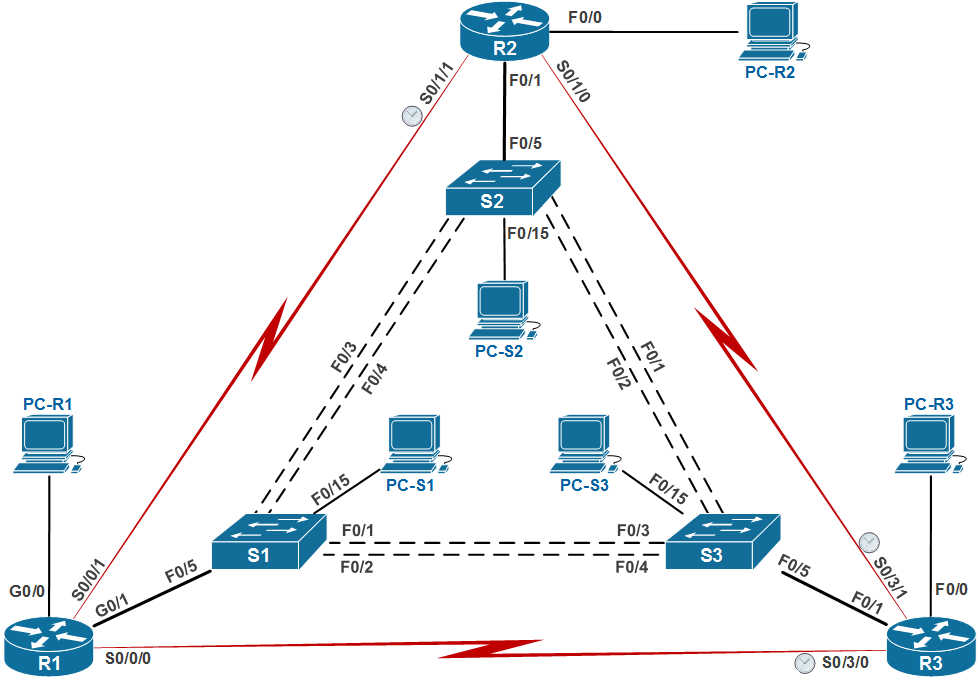
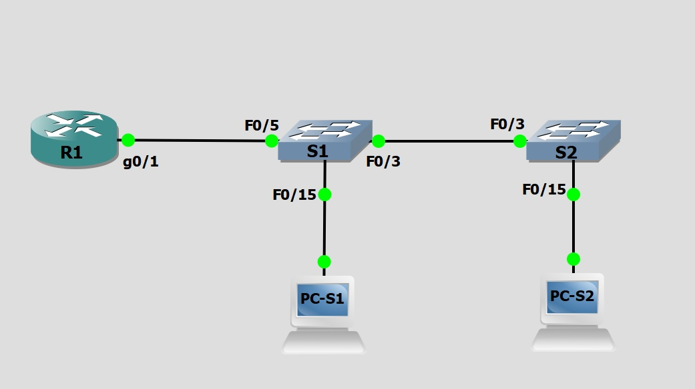

# Scaling VLANs.
# Lab №1. Configure Router-on-a-Stick Inter-VLAN Routing 

### Physical network topology diagram



### Logical network topology diagram




### Addressing Table
| Device | Interface | IP Address   | Subnet Mask   | Default Gateway |
| ------ | --------- | ------------ | ------------- | --------------- |
| R1     | G0/0/1.3  | 192.168.3.1  | 255.255.255.0 | N/A             |
| R1     | G0/0/1.4  | 192.168.4.1  | 255.255.255.0 | N/A             |
| R1     | G0/0/1.8  | N/A          | N/A           | N/A             |
| S1     | VLAN 3    | 192.168.3.11 | 255.255.255.0 | 192.168.3.1     |
| S2     | VLAN 3    | 192.168.3.12 | 255.255.255.0 | 192.168.3.1     |
| PC-S1   | NIC       | 192.168.3.3  | 255.255.255.0 | 192.168.3.1     |
| PC-S2   | NIC       | 192.168.4.3  | 255.255.255.0 | 192.168.4.1     |


### VLAN Table
| VLAN |    Name    | Interface Assigned                               |
| ---- | :--------: | :----------------------------------------------- |
| 3    | Management | **S1**: VLAN 3 <br />  **S2**: VLAN 3  <br />  **S1**: F0/15 |
| 4    | Operations | **S2**: F0/15                                        |
| 7    | ParkingLot | **S1**: F0/1-2, F0/4, F0/6-14, F0/16-24, G0/1-2<br/>  **S2**: F0/1-2,  F0/4-14, F0/16-24, G0/1-2      |
| 8    |   Native   | N/A                                              |


# Objectives

​*         **Part 1: Build the Network and Configure Basic Device Settings**

​*         **Part 2: Create VLANs and Assign Switch Ports**

​*         **Part 3: Configure an 802.1Q Trunk between the Switches**

​*         **Part 4: Configure Inter-VLAN Routing on the Router**

​*         **Part 5: Verify Inter-VLAN Routing is working**


### Task:
#### [Part 1: Build the Network and Configure Basic Device Settings ](README.md#part-1-build-the-network-and-configure-basic-device-settings)

* **Step 1: Cable the network as shown in the topology**
* **Step 2: Configure basic settings for the router**

      a.  Console into the router and enable priviliged EXEC mode
      b.  Enter configuration mode
      c.  Assign a device name to the router
      d.  Disable DNS lookup to prevent the router from attempting to translate incorrectly entered commands as though they were host names.
      e.  Assign class as the privileged EXEC encrypted password
      f.  Assign cisco as the console password and enable login
      g.  Assign cisco as the VTY password and enable login
      h.  Encrypt the plaintext passwords.
      i.  Create a banner that warns anyone accessing the device that unauthorized access is prohibited
      j.  Save the running configuration to the startup configuration file.
      k.  Set the clock on the router
      
* **Step 3: Configure basic settings for each switch.**  
 
      a.  Console into the switch and enable priviliged EXEC mode
      b.  Enter configuration mode
      c.  Assign a device name to the switch
      d.  Disable DNS lookup to prevent the switch from attempting to translate incorrectly entered commands as though they were host names.
      e.  Assign class as the privileged EXEC encrypted password
      f.  Assign cisco as the console password and enable login
      g.  Assign cisco as the VTY password and enable login
      h.  Encrypt the plaintext passwords.
      i.  Create a banner that warns anyone accessing the device that unauthorized access is prohibited
      j.  Save the running configuration to the startup configuration file.
      k.  Set the clock on the switch
      
* **Step 4:  Configure PC hosts.**   
     _Refer to the Addressing Table for PC host address information._     
   

#### [Part 2: Create VLANs and Assign Switch Ports ](README.md#часть-2-настройка-динамического-протокола-транкинга-dtp)
   In Part 2, you will create VLANs, as specified in the table above, on both switches. You will then assign the VLANs to the appropriate interface. The show vlan command is          used to verify your configuration settings. Complete the following tasks on each switch
* **Step 1: Create VLANs on both switches.**  

      a.  Create and name the required VLANs on each switch from the table above.
      b.  Configure the management interface and default gateway on each switch using the IP address
          information in the Addressing Table. 
      c.  Assign all unused ports on both switches to the ParkingLot VLAN, configure them for static access mode,
          and administratively deactivate them.

* **Step 2:  Assign VLANs to the correct switch interfaces..**   

      a.  Assign used ports to the appropriate VLAN (specified in the VLAN table above) and configure them for
          static access mode. Be sure to do this on both switches
      b.  Issue the show vlan brief command and verify that the VLANs are assigned to the correct interfaces.
      
#### [Part 3:  Configure an 802.1Q Trunk Between the Switches ](README.md#часть-2-настройка-динамического-протокола-транкинга-dtp)
  In Part 3, you will manually configure interface F0/3 as a trunk.
  
* **Step 1:  Manually configure trunk interface F0/3.** 

      a.  Change the switchport mode on interface F0/3 to force trunking. Make sure to do this on both switches.
      b.  As a part of the trunk configuration, set the native VLAN to 8 on both switches. You may see error messages
          temporarily while the two interfaces are configured for different native VLANs.
      c.  As another part of trunk configuration, specify that VLANs 3, 4, and 8 are only allowed to cross the trunk
      d.  Issue the show interfaces trunk command to verify trunking ports, the Native VLAN and allowed VLANs
          across the trunk.
          
* **Step 2:  Manually configure S1’s trunk interface F0/5.** 

      a.  Configure the F0/5 on S1 with the same trunk parameters as F0/3. This is the trunk to the router
      b.  Save the running configuration to the startup configuration file on S1 and S2
      c.  Issue the show interfaces trunk command to verify trunking.
             Why does F0/5 not appear in the list of trunks?
             
#### [Part 4:  Configure Inter-VLAN Routing on the Router ](README.md#часть-2-настройка-динамического-протокола-транкинга-dtp) 

      a.  Activate interface G0/1 on the router.
      
      b.  Configure sub-interfaces for each VLAN as specified in the IP addressing table. All sub-interfaces use
          802.1Q encapsulation. Ensure the sub-interface for the native VLAN does not have an IP address
          assigned. Include a description for each sub-interface.
          
      c.  Use the show ip interface brief command to verify the sub-interfaces are operational. 
      
 #### [Part 5: Verify Inter-VLAN Routing is Working ](README.md#часть-2-настройка-динамического-протокола-транкинга-dtp) 
 
* **Step 1:  Complete the following tests from PC-A. All should be successful.**

      a.  Ping from PC-S1 to its default gateway.
      b.  Ping from PC-S1 to PC-S2
      c.  Ping from PC-S1 to S2
      
* **Step 2:  Complete the following test from PC-B.**     

      From the command prompt on PC-B, issue the tracert command to the address of PC-A.
      Question:
        What intermediate IP addresses are shown in the results?

      
### Solution:
#### Part 1: Build the Network and Configure Basic Device Settings

Configuring basic settings for the router
``` bash
Router>enable
Router#conf t
Enter configuration commands, one per line.  End with CNTL/Z.
Router(config)#hostname R1
R1(config)#no ip domain-lookup 
R1(config)#enable secret class
R1(config)#line console 0
R1(config-line)#password cisco
R1(config-line)#login
R1(config-line)#line vty 0 15
R1(config-line)#password cisco
R1(config-line)#login
R1(config-line)#exit
R1(config)#service password-encryption 
R1(config)#banner login #Unauthorized access is prohibited!!!# 
R1(config# do copy running-config startup-config
Destination filename [startup-config]? 
Building configuration...
[OK] 
R1(config)#clock timezone IST 3

*Jul 14 11:29:48.115: %SYS-6-CLOCKUPDATE: System clock has been updated from 11:29:48 UTC Tue Jul 14 2020 to 14:29:48 IST Tue Jul 14 2020, configured from console by console.
R1(config)#exit
R1#
*Jul 14 11:30:07.035: %SYS-5-CONFIG_I: Configured from console by console   
R1#clock set 14:30:00 Jul 14 2020
R1#
*Jul 14 11:30:00.000: %SYS-6-CLOCKUPDATE: System clock has been updated from 14:30:46 IST Tue Jul 14 2020 to 14:30:00 IST Tue Jul 14 2020, configured from console by console.
R1#clock update-calendar 
R1#
```

      
